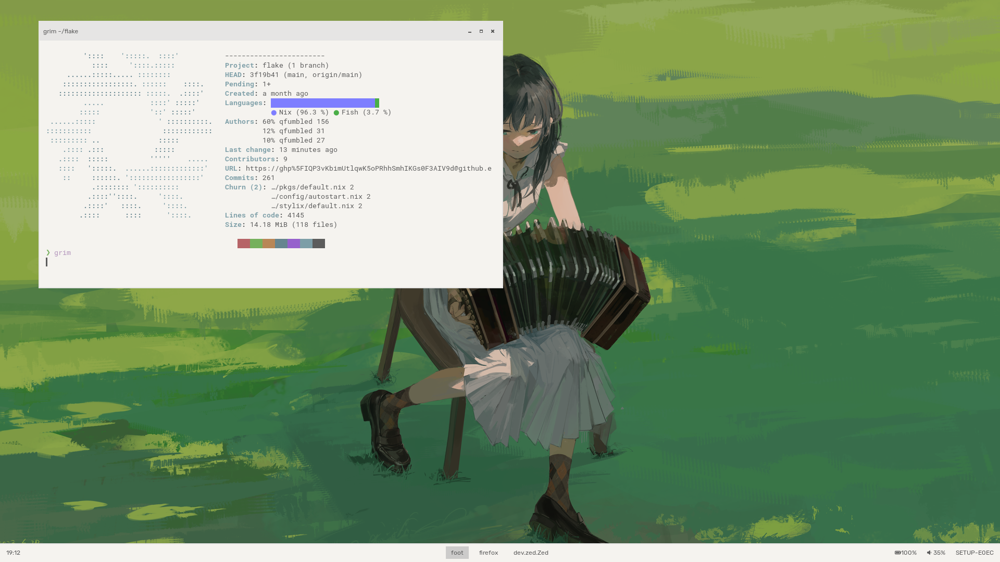
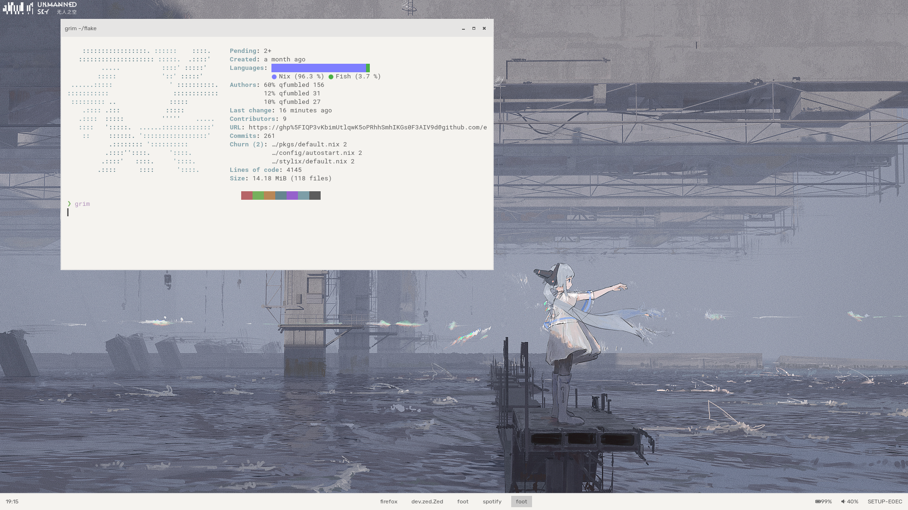

> As of Augusto 18, 2025

## shots. (will add dark mode ones soon but im lazy)

- WM: `labwc`
- Bar: `waybar`
- Terminal: `foot`
- Shell: `fish` + `starship` mainly but theres zsh but i don't use that a lot
- Editor: `nixvim`
- Launcher: `fuzzel`
- Notifications: `mako`
- Wallpaper: `swaybg`
